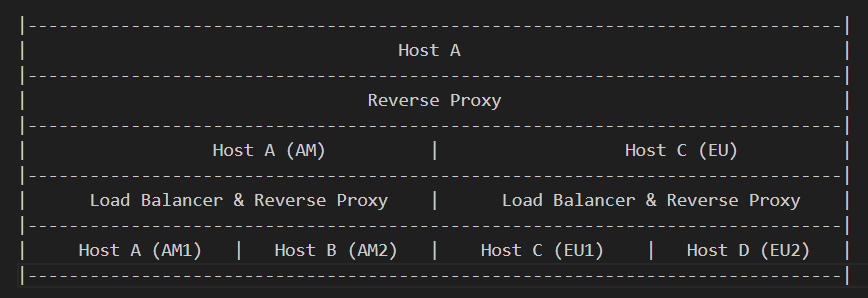

# Projeto - Sistemas Distribuídos

Esse projeto visa aplicar os conceitos aprendidos na disciplina **SSC0904 - Sistemas Computacionais Distribuídos**.

## Ideia

Criamos uma aplicação web simples com front-end e back-end em que o usuário pode acumular diferentes pokemóns para sua coleção.

O foco da aplicação foi construir uma estrutura de back-end distribuída. Para isso, alocamos quatro hosts, de forma que cada host atende um servidor. Dois servidores serão para a América e os outros dois serão para a Europa. Essa distribuição das requisições será feito a partir do endereço IP.  
A carga de cada uma dessas regiões será distribuída entre os dois servidores por um Load Balancer utilizando a configuração de Least Connections, no qual a requisição é enviada para o servidor com o menor número de conexões ativas. A transparência de acesso e localização será responsabilidade dos Reverse Proxies que estão na infraestrutura.   
A infraestrutura do sistema pode ser vista abaixo:



## Tecnologias
Para fazer os servidores, utilizamos a biblioteca Flask do Python.

Foi utilizado o MongoDB como SGBD do nosso sistema. A arquitetura do banco de dados pode ser vista abaixo:

    User {
		username: String, UNIQUE 1
		email: String, UNIQUE 2
		password: BinData,
		region: String ENUM
	}

	UserPokemon {
		pokemon: Number, 
		user_id: ObjectID, UNIQUE 1
		date: Date, UNIQUE 1
	}

Utilizamos o NGINX para os Load Balancers e para o Reverse Proxy.

********************TODO Adicionar as tecnologias do front-end

As máquinas virtuais em que os servidores estão hospedados são do DigitalOcean, sendo:
Descrição    | Caminho
--------|-----------
Nginx/Aplicação | 161.35.30.200
AM-1 | 64.226.125.28:8080
AM-2 | 64.226.109.169:8080
EU-1 | 206.81.20.72:8080
EU-2 | 64.226.106.15:8080

Observação: As aplicações só aceitam requisições encaminhadas pelo Nginx, então não é possível acessar diretamente cada uma. Para realizar o teste, acesse http://161.35.30.200/ping. 

## Back-end

### Instalação 

É recomendado o uso de Python Virtual Envirorment. Então para criá-lo e ativá-lo:
```
python3 -m venv venv
source venv/bin/activate
```

Em seguida, é necessário instalar as bibliotecas :
```
pip3 install -r requirements.txt
```

Por fim, colocar o ```.env``` na pasta /backend.

### Utilização
Para executar um servidor isolado, utilize `python3 app.py -n <server_name> -r <region> -p <port>`. 
Exemplo: 
```
python3 app.py -n AM1 -r AM -p 80
```
Para mais informações quanto a rodar o servidor, rode `python3 app.py -h`.

Por fim, para a aplicação funcionar conforme descrito anteriormente, é necessário criar 4 instâncias. Considerando que todas as instâncias estão em um mesmo servidor por simplicidade, elas podem ser criadas com os comandos:
```
python3 app.py -n AM1 -r AM -p 8081 &
python3 app.py -n AM2 -r AM -p 8082 &
python3 app.py -n EU1 -r EU -p 8083 & 
python3 app.py -n EU2 -r EU -p 8084 &
```
Se as instâncias estão em servidores diferentes, a mesma lógica pode ser aplicada apenas alterando o IP/Porta.

Para confirmar que tudo funcionou, utilize:
```
curl 127.0.0.1:[porta]/ping
```
Observação: No caso de servidores com digito par (como AM2), a requisição para ```/ping``` possui um atraso de 15 segundos para simular uma requisição com bastante carga.

## Reverse Proxy & Load Balancer

Os comandos foram descritos considerando que o sistema operacional é o Ubuntu, caso seja diferente, é necessário utilizar o comando análogo para a distribuição correspondente.

### Instalação 

Para instalar, use o comando:
```
apt install nginx
```

*************** TODO Escrever sobre instalação do pacote de geo

### Utilização

Altere o arquivo nginx.conf disponibilizado em /backend conforme necessário. Por exemplo, caso as 4 instâncias da aplicação estejam na mesma máquina (conforme demonstrado na seção anterior) do Nginx, altere o IP/Porta conforme a seguir:
```
upstream am {
	least_conn;
	server 127.0.0.1:8081;
	server 127.0.0.1:8082;
}

upstream eu {
	least_conn;
	server 127.0.0.1:8083;
	server 127.0.0.1:8084;
}
```

Em seguida, reinicie o Nginx:
```
systemctl restart nginx
```

Com isso, o Nginx funciona como Reverse Proxy e Load Balancer. Para confirmar se tudo funcionou, faça múltplas chamadas ao Nginx e confirme se são direcionadas para diferentes servidores: 
```
curl 127.0.0.1:80/ping
```

Observação: Caso o Nginx não esteja na mesma máquina que as instâncias, é necessário alterar no arquivo ```.env``` de cada aplicação o IP do Nginx para que elas aceitem requisição dele. Esta configuração é feita através da variável ```REVERSE_PROXY_IP```.

## Front-end

*************TODO Criar o passo a passo de instalão e utilização

### Instalação

...

### Utilização

...

## Integrantes
Nome    | Número USP
--------|-----------
Bruna Magrini da Cruz | 11218813
Gabriel Freitas Ximenes de Vasconcelos | 11819084
Otto Cruz Fernandes | 11275130
Raíssa Torres Barreira | 11796336
Yasmin Osajima de Araújo | 11219004
