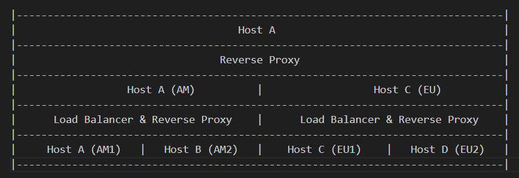

# Projeto - Sistemas Distribuídos

Esse projeto visa aplicar os conceitos aprendidos na disciplina **SSC0904 - Sistemas Computacionais Distribuídos**.

## Ideia

Criamos uma aplicação web simples com front-end e back-end em que o usuário pode acumular diferentes pokemóns para sua coleção.

O foco da aplicação foi construir uma estrutura de back-end distribuída. Para isso, alocamos quatro hosts, de forma que cada host atende um servidor. Dois servidores serão para a América e os outros dois serão para a Europa. Essa distribuição das requisições será feito a partir do endereço IP.

A carga de cada uma dessas regiões será distribuída entre os dois servidores por um Load Balancer. A transparência de acesso e localização será responsabilidade dos Reverse Proxies que estão na infraestrutura. A infraestrutura do sistema pode ser vista abaixo:

## Tecnologias
Para fazer os servidores, utilizamos a biblioteca Flask do Python.

Foi utilizado o MongoDB como SGBD do nosso sistema. A arquitetura do banco de dados pode ser vista abaixo:

    User {
		username: String, UNIQUE 1
		email: String, UNIQUE 2
		password: String,
		region: String ENUM
	}

	UserPokemon {
		pokemon: Number, UNIQUE 1
		user_id: ObjectID UNIQUE 1,
		quantity: Number
	}

Utilizamos o NGINX para os Load Balancers e para o Reverse Proxy.
As máquinas virtuais em que os servidores estão hospedados foram disponibilizados pelo [colocar aqui].

## Utilização
Para utilizar o site, acesse o link [colocar aqui].

Para executar um servidor isolado, utilize `python3 app.py -n <server_name> -r <region> -p <port>`.
Para mais informações quanto a rodar o servidor, rode `python3 app.py -h`.

[etc]

## Integrantes
Nome    | Número USP
--------|-----------
Bruna Magrini da Cruz | [colocar aqui]
Gabriel Freitas Ximenes de Vasconcelos | 11819084
Otto Cruz Fernandes | 11275130
Raíssa Torres Barreira | 11796336
Yasmin Osajima de Araújo | 11219004